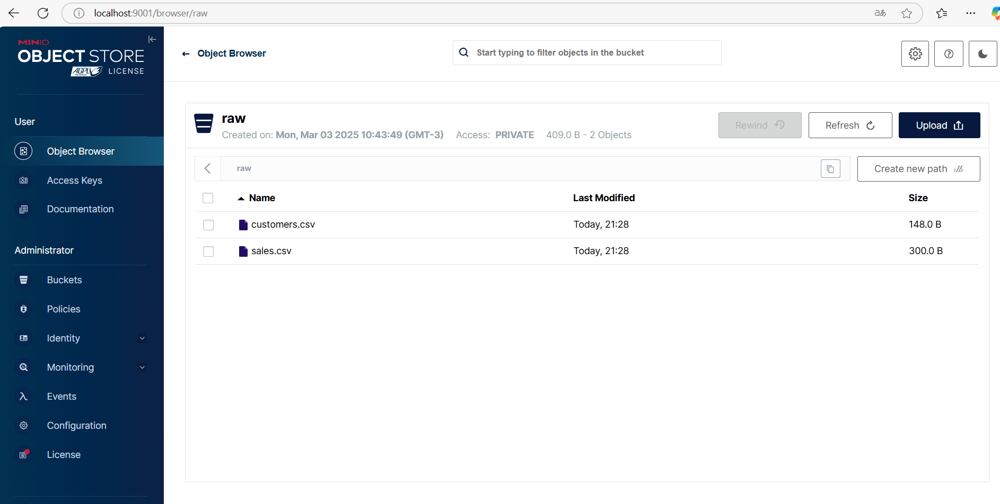
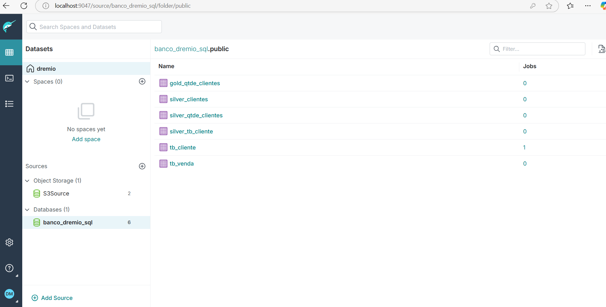
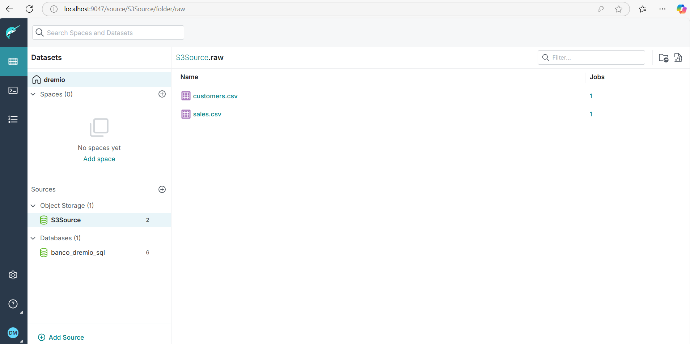

# Estrutura do Projeto com Poetry

Este é um projeto de integração entre **Dremio**, **dbt**, **PostgreSQL** e **Docker**, utilizando o **Poetry** para gerenciar dependências. O projeto tem como objetivo realizar análises de dados e gerenciar um Data Lake com Dremio e dbt.

## Estrutura do Projeto

```
project/
├── docker/
│   ├── docker-compose.yml
│   └── dremio-setup.sh
├── dbt/
│   ├── models/
│   │   ├── silver/
│   │   │   └── silver_qtde_clientes.sql
│   │   └── gold/
│   │       └── gold_qtde_clientes.sql
│   ├── dbt_project.yml
│   └── profiles.yml
├── pyproject.toml
└── poetry.lock
```

## Passo 1: Instalar o Poetry

Se você ainda não tem o Poetry instalado, use o comando abaixo para instalá-lo:

```bash
curl -sSL https://install.python-poetry.org | python3 -
```

## Passo 2: Criar o Projeto com Poetry

No diretório raiz do projeto, inicialize o Poetry:

```bash
poetry init
```

Siga as instruções para gerar o arquivo `pyproject.toml`, onde você pode incluir as dependências necessárias.

## Passo 3: Instalar as Dependências

Adicione o dbt como dependência do projeto, usando o Poetry:

```bash
poetry add dbt-postgres
```

Isso vai adicionar o dbt com suporte para o PostgreSQL no seu projeto.

## Passo 4: Refatorando o Código

### `pyproject.toml`

Este é o arquivo de configuração do Poetry. Ele deve ter as dependências do dbt, além de outras configurações do seu projeto:

```toml
[tool.poetry]
name = "project_name"
version = "0.1.0"
description = "Projeto com Dremio, dbt e PostgreSQL"
authors = ["Seu Nome <seuemail@dominio.com>"]
license = "MIT"

[tool.poetry.dependencies]
python = "^3.8"
dbt-postgres = "^1.0"

[tool.poetry.dev-dependencies]
```

### `profiles.yml`

Este arquivo configura o acesso ao PostgreSQL para o dbt, utilizando as credenciais fornecidas:

```yaml
default:
  outputs:
    dev:
      type: postgres
      host: dpg-cv2rncij1k6c739ofhag-a.oregon-postgres.render.com
      user: banco_dremio_sql_user
      password: L9py97LBW21AmTKu9C2LwbwIS2ajrPkZ
      port: 5432
      dbname: banco_dremio_sql
      schema: public
  target: dev
```

Coloque o arquivo `profiles.yml` na pasta `~/.dbt` ou no diretório `dbt/` do seu projeto, conforme a sua configuração.

### `dbt_project.yml`

Este é o arquivo de configuração do dbt, onde você define seu projeto:

```yaml
name: 'project_name'
version: '1.0'
profile: 'default'
config-version: 2

models:
  silver:
    +materialized: table
  gold:
    +materialized: table
```

### `docker-compose.yml`

O arquivo do Docker Compose permanece o mesmo, mas você pode adicionar um serviço para rodar o Poetry, se desejar rodar os scripts diretamente de dentro do container Docker. Caso contrário, basta rodar as dependências do Poetry diretamente na sua máquina local.

```yaml
version: '3'
services:
  # Nessie Catalog Server Using In-Memory Store
  nessie:
    image: projectnessie/nessie:latest
    container_name: catalog
    networks:
      - dremio-network
    ports:
      - 19120:19120

  # Minio Storage Server
  minio:
    image: minio/minio:latest
    container_name: storage
    environment:
      - MINIO_ROOT_USER=admin
      - MINIO_ROOT_PASSWORD=password
      - MINIO_DOMAIN=storage
      - MINIO_REGION_NAME=us-east-1
      - MINIO_REGION=us-east-1
    networks:
      - dremio-network
    ports:
      - 9001:9001
      - 9000:9000
    command: [ "server", "/data", "--console-address", ":9001" ]
    volumes:
      - minio_data:/data

  minio-setup:
    image: minio/mc
    container_name: minio-setup
    depends_on:
      - minio
    entrypoint: >
      /bin/sh -c "
      until (echo > /dev/tcp/minio/9000) >/dev/null 2>&1; do
        echo 'Waiting for MinIO...';
        sleep 2;
      done;
      mc alias set myminio http://minio:9000 admin password;
      mc mb myminio/raw;
      mc ls myminio;
      "
    networks:
      - dremio-network

  # Dremio
  dremio:
    image: dremio/dremio-oss:latest
    ports:
      - 9047:9047
      - 31010:31010
      - 32010:32010
      - 45678:45678
    container_name: dremio
    environment:
      - DREMIO_JAVA_SERVER_EXTRA_OPTS=-Dpaths.dist=file:///opt/dremio/data/dist -Ddebug.addDefaultUser=true
      - SERVICES_COORDINATOR_ENABLED=true
      - SERVICES_EXECUTOR_ENABLED=true
    networks:
      - dremio-network
    volumes:
      - dremio_data:/opt/dremio/data:rw
    user: "0"
  
  dremio-setup:
    image: alpine:latest
    container_name: dremio-setup
    depends_on:
      - dremio
    volumes:
      - ./docker/dremio-setup.sh:/dremio-setup.sh
    command: sh /dremio-setup.sh
    networks:
      - dremio-network
       
networks:
  dremio-network:

volumes:
  dremio_data:
  minio_data:
```

## Passo 5: Executando o Projeto

### Instalar as dependências

Primeiro, instale as dependências do Poetry:

```bash
poetry install
```

### Rodar os containers com Docker Compose

Com os containers configurados no `docker-compose.yml`, execute o comando abaixo para iniciar os serviços:

```bash
docker-compose up
```

### Executar o dbt

Após os containers estarem funcionando, você pode rodar os comandos do dbt para executar seus modelos. Use o Poetry para gerenciar o ambiente Python:

```bash
poetry run dbt run
```

Agora você tem um projeto estruturado com **Poetry**, **Docker**, **Dremio**, **MinIO**, **dbt** e **PostgreSQL**, pronto para ser executado e gerenciado facilmente.

---

### Explicação de `ref()` e `source()` no dbt

No dbt, a função `ref()` é usada para fazer referência a outro modelo dentro do projeto dbt, enquanto `source()` é usada para fazer referência a uma tabela ou fonte externa.

- **`ref()`**: Usado para referenciar um modelo que foi previamente criado no dbt. Ele cria uma dependência entre os modelos, de forma que o dbt sabe em que ordem eles devem ser executados. Quando você utiliza `{{ ref('silver_qtde_clientes') }}`, você está dizendo ao dbt para usar o modelo `silver_qtde_clientes` que foi gerado e materializado anteriormente.

- **`source()`**: Usado para referenciar tabelas externas, geralmente em bancos de dados ou data lakes. Quando você usa `{{ source('postgres', 'tb_cliente') }}`, está fazendo uma referência a uma tabela `tb_cliente` no banco de dados PostgreSQL configurado no arquivo `profiles.yml`.

O uso de `ref()` e `source()` ajuda a organizar e otimizar o fluxo de dados no dbt, criando dependências claras entre os modelos e fontes.

Agora você tem um projeto estruturado com **Poetry**, **Docker**, **Dremio**, **MinIO**, **dbt** e **PostgreSQL**, pronto para ser executado e gerenciado facilmente.


# Evidências

Minio



Dremio

Postgresql


Minio

